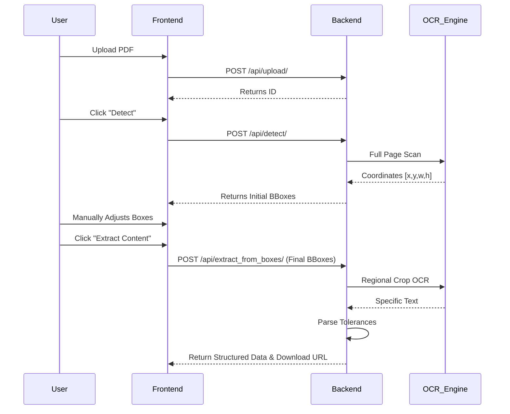

# 📐 Engineering Drawing Dimension Extractor

A state-of-the-art full-stack application designed to automate the extraction of dimensional data from engineering drawings (PDFs/Images). The system utilizes a hybrid OCR pipeline combining vector extraction and deep learning to achieve near-perfect accuracy.

---

## 🚀 Project Overview

Manually transcribing dimensions from technical drawings into Excel or inspection reports is labor-intensive and error-prone. This tool provides an automated workflow:
1.  **Smart Detection**: Automatically identifies dimension regions using AI.
2.  **Human-in-the-Loop**: Interactive canvas allows users to refine, rotate, and add bounding boxes.
3.  **Advanced Extraction**: High-precision OCR extracts nominal values and tolerances.
4.  **Structured Export**: Downloads a formatted `.txt` file ready for further processing.

---

## 📂 Folder Structure & File Explanations

The project is structured as a **Monorepo**, keeping the Frontend and Backend tightly coupled for consistency.

### 🐍 Backend (Django)
Located in `/backend`, the backend handles image processing, OCR, and data persistence.

#### Key Files & Why They Exist:
| File | Role | Why it's used |
| :--- | :--- | :--- |
| `extractor/views.py` | API Controller | Contains endpoints for upload, detection, extraction, and download. It orchestrates the flow. |
| `extractor/models.py` | Database Schema | Defines the `UploadedDrawing` structure (file paths, timestamps, extracted text). |
| `services/pipeline.py` | Main Engine | Coordinates the hybrid approach (trying vector extraction first, then docTR OCR). |
| `services/doctr_engine.py` | Deep Learning OCR | Interfaces with the docTR library to read text from pixel data (ideal for scanned drawings). |
| `services/vector_engine.py` | Vector Extraction | Uses PyMuPDF to extract "native" text from CAD-generated PDFs with 100% precision. |
| `services/tolerance_parser.py` | Regex Parser | Specialized logic to split strings like `Ø50 +0.1/-0.2` into Nominal, Upper Tol, and Lower Tol. |
| `services/bbox_detector.py` | AI Detection | Scans the whole drawing to suggest initial locations of dimensions. |
| `manage.py` | Django CLI | The entry point for running the server, migrations, and shell commands. |

---

### ⚛️ Frontend (React)
Located in `/frontend`, the frontend provides the interactive user experience.

#### Key Files & Why They Exist:
| File | Role | Why it's used |
| :--- | :--- | :--- |
| `src/App.jsx` | Main State Machine | Manages the 3-step workflow (Upload -> Adjust -> Export) and stores global app state. |
| `src/api.js` | API client | Centralizes all Axios configurations/headers for communication with the Django backend. |
| `src/components/DrawingViewer/` | Interactive Canvas | Built with Konva.js, this allows users to draw, move, and rotate boxes on top of the PDF image. |
| `src/components/DataTable.jsx` | Data Grid | A spreadsheet-like UI for final review and editing of extracted values before export. |
| `src/index.css` | Design System | Contains the premium styling (glassmorphism, dark mode, custom scrollbars). |

---

## 🛠️ Combined Setup Instructions

### 1. Prerequisites
- Python 3.9+
- Node.js 16+
- MySQL Server (for database persistence)

### 2. Backend Setup
```bash
cd backend
python -m venv venv
source venv/bin/activate  # Or venv\Scripts\activate on Windows
pip install -r requirements.txt
python manage.py migrate
python manage.py runserver
```

### 3. Frontend Setup
```bash
cd frontend
npm install
npm start
```

---

## 🔄 Workflow Logic



---

## ❓ Why "One Common File"? (Monorepo Choice)

You may notice the project resides in a single directory rather than separate repositories. This is intentional:

1.  **Coordination**: The Frontend (Canvas) and Backend (Image Cropping) must use the same "Coordinate Language". Keeping them together ensures changes in the coordinate math are always synchronized.
2.  **Simplified Context**: For a single engineer or a small team, a monorepo eliminates the "version mismatch" between the UI and the API.
3.  **unified Documentation**: We provide a "Common Document" (`Project_Explanation.html`) that serves as a single source of truth for the entire project's architecture, including both frontend and backend details.
4.  **Deployment Atomic**: When you push a feature, you push the UI and the Engine logic at the exact same time, ensuring the system never breaks due to partial updates.

---

## 📜 Technology Stack
- **AI/ML**: docTR (Document Text Recognition), PyTorch/TensorFlow.
- **Vision**: OpenCV, PyMuPDF, Pillow.
- **Backend**: Django, Django REST Framework, MySQL.
- **Frontend**: React, Konva (Canvas), Lucide Icons, Smooth Animations.

---
*Created for Engineering Intelligence Teams.*
