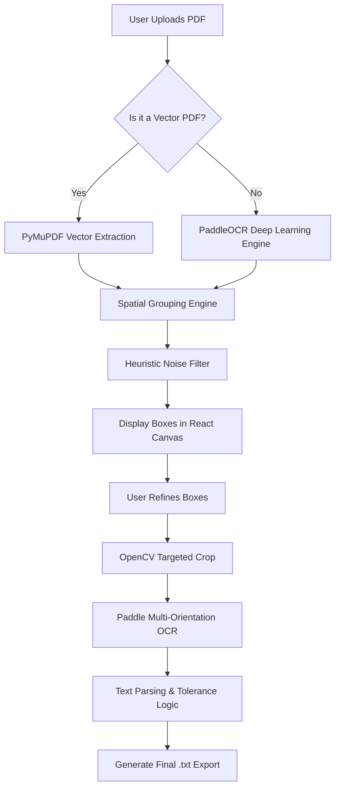

# 📐 Engineering Drawing Dimension Extractor (Full Guide)

Welcome to the **Dimension Extractor** project. This is a production-grade internal tool designed to automate the extraction of dimensional data (Values, Units, Tolerances) from engineering drawings (PDFs/Scans).

> [!TIP]
> **View the Premium Guide**: For a better visual experience, open [Project_Explanation.html](Project_Explanation.html) in your browser.

---

## 🚀 1. The Core Objective (Start-to-End)
Manual data entry from drawings is slow and error-prone. This tool provides a **5-step automated journey**:
1.  **Upload**: User drops a PDF into the React portal.
2.  **Detection**: The backend runs a **Hybrid Pipeline** (Vector Parsing or PaddleOCR) to find potential dimensions.
3.  **Refine**: User interacts with a Konva.js canvas to adjust, add, or delete red bounding boxes.
4.  **Extract**: The backend crops these specific boxes and runs a high-focus multi-orientation OCR to get the text.
5.  **Export**: The text is parsed into structured chunks (Nominal, Upper Tol, Lower Tol) and exported as a `.txt` report.

---

## 🛠️ 2. Technology Stack & Dependencies

### 🐍 Backend (Python / Django)
| Dependency | Why & What is it used for? |
| :--- | :--- |
| **Django 4.2** | The "Skeleton". Handles the API, file storage (Media), and database interactions. |
| **PaddleOCR** | The "Improved Eyes". A deep learning OCR engine that handles multi-orientation text and offers superior accuracy for technical drawings. |
| **OpenCV** | The "Scalpel". Used to crop specific regions from the drawing for targeted processing and handles image pre-processing. |
| **PyMuPDF (fitz)** | The "Perfect Reader". Directly extracts native text from CAD-generated PDFs with 100% precision. |
| **pdf2image** | The "Bridge". Converts PDF pages into high-bitrate images so they can be viewed in browsers. |
| **mysqlclient** | The "Memory". Connects Django to the MySQL database for persistent storage. |

### ⚛️ Frontend (React / JavaScript)
| Dependency | Why & What is it used for? |
| :--- | :--- |
| **React 18** | The "State". Manages the complex multi-step user flow without page reloads. |
| **Konva / React-Konva** | The "Canvas". Allows drawing/moving red rectangles over the PDF image in real-time. |
| **Axios** | The "Messenger". Handles all HTTP communication between the Frontend and Backend. |
| **Bootstrap 5** | The "Style". Provides the layout components for a professional, responsive look. |

---

## 📂 3. Exhaustive File Breakdown

### 📂 `backend/services/` (The Logic Layer)
- `pipeline.py`: The Main Brain. Decides which tool (Vector vs PaddleOCR) to use for a specific file.
- `vector_engine.py`: Specialized code to read "hidden" text inside digital PDFs.
- `paddle_engine.py`: Loads the Paddle AI models and processes the image pixels with multi-rotation support (0°, 90°, 180°, 270°).
- `grouping_engine.py`: Joins broken text tokens (e.g., if "20" and ".5" are separate, it makes "20.5").
- `tolerance_parser.py`: Uses complex "Regex" patterns to split "50 ±0.1" into three data fields.
- `bbox_detector.py`: Scans the whole page to suggest where dimensions might be.
- `extractor.py`: Handles the final "Crop and Read" logic for user-adjusted boxes using PaddleOCR.

### 📂 `backend/extractor/` (The API Layer)
- `views.py`: Defines the URL endpoints (`/api/upload`, `/api/process`, etc.) that the frontend calls.
- `models.py`: Defines the `UploadedDrawing` table in the database.
- `serializers.py`: Converts database rows into JSON format for the web browser.

### 📂 `frontend/src/` (The User Layer)
- `App.jsx`: Global controller managing the Upload -> Process -> Result state.
- `api.js`: Configuration for all backend API calls.
- `components/DrawingViewer/`: Contains the logic for the interactive Konva canvas.
- `components/ProcessSection.jsx`: The UI for the "Detecting..." phase with progress indicators.

---

## 🔄 4. How the "Magic" Works (The Processing Flow)

---

## 🚀 5. Getting Started
1.  **Backend**: `cd backend && pip install -r requirements.txt && python manage.py runserver`
2.  **Frontend**: `cd frontend && npm install && npm start`
3.  **Database**: Ensure MySQL is running and credentials are set in `backend/.env`.

---
*Updated to reflect the implementation of PaddleOCR for superior dimensional extraction.*
*Created for the Engineering Intelligence Team.*
