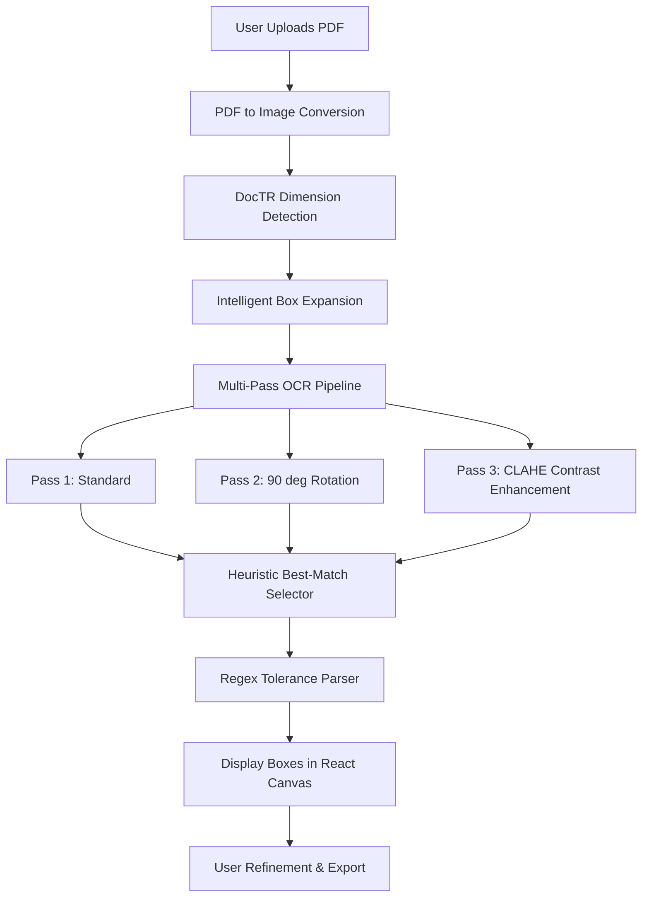

# 📐 Engineering Drawing Dimension Extractor

Welcome to the **Dimension Extractor** project. This tool automates the extraction of dimensional data (Values, Units, Tolerances) from engineering drawings (PDFs/Scans) using a high-precision pipeline powered by **DocTR** and **PaddleOCR**.

---

## 🚀 1. The Core Objective
This tool provides a professional workflow for technical data extraction:
1.  **Upload**: Upload a PDF/Image via the React portal.
2.  **Detection**: Backend runs **DocTR** to pinpoint exact locations of dimension callouts.
3.  **Expansion**: Detected regions are intelligently expanded to ensure no tolerance data is cropped.
4.  **OCR**: Backend runs **PaddleOCR** with multiple passes (Original, Rotated 90°, Contrast Enhanced) to maximize accuracy.
5.  **Refine**: Use the interactive Konva.js canvas to adjust or add bounding boxes if needed.
6.  **Export**: Data is parsed into structured fields (Dimension, Upper Tolerance, Lower Tolerance) and exported.

---

## 🛠️ 2. Technology Stack
*   **Object Detection**: DocTR (Document Text Recognition) for high-precision dimension localization.
*   **OCR Engine**: PaddleOCR (with Angle Classification) for character recognition.
*   **Backend**: Django 4.2 (Python), OpenCV, PyMuPDF (fitz).
*   **Frontend**: React 18, Konva.js (Canvas API), Axios, Tailwind CSS.
*   **Database**: MySQL.

---

## 💻 3. Setup from Scratch (GitHub Clone)

Follow these steps to set up the project on a new system.

### 📋 Prerequisites
*   **Python**: 3.10 or higher.
*   **Node.js**: 18.x or higher.
*   **MySQL**: Installed and running.
*   **Poppler**: Required for `pdf2image`. 
    *   *Windows*: Download from [GitHub](https://github.com/oschwartz10612/poppler-windows/releases) and add the `bin` folder to your System PATH.
    *   *Linux*: `sudo apt-get install poppler-utils`.

### 📂 Step 1: Clone the Repository
```bash
git clone <your-repository-url>
cd dimension_extractor
```

### 🗄️ Step 2: Database Setup
1. Open your MySQL terminal or GUI (like Workbench).
2. Create a new database:
   ```sql
   CREATE DATABASE dimension_db;
   ```

### 🐍 Step 3: Backend Configuration
1. Navigate to the backend folder:
   ```bash
   cd backend
   ```
2. Create and activate a virtual environment:
   ```bash
   python -m venv menv
   .\menv\Scripts\activate  # On Windows
   source menv/bin/activate  # On Linux/macOS
   ```
3. Install dependencies:
   ```bash
   pip install -r requirements.txt
   ```
   *Note: On first run, DocTR and PaddleOCR will automatically download their pre-trained weights.*

4. Configure environment variables:
   *   Create a `.env` file in the `backend/` directory.
   *   Copy the following and update with your MySQL credentials:
   ```env
   SECRET_KEY=your-secret-key
   DEBUG=True
   DB_NAME=dimension_db
   DB_USER=your_username
   DB_PASSWORD=your_password
   DB_HOST=localhost
   DB_PORT=3306

   # docTR Settings
   DOCTR_BACKEND=torch
   USE_TORCH=1
   ```
5. Run migrations:
   ```bash
   python manage.py makemigrations
   python manage.py migrate
   ```
6. Start the server:
   ```bash
   python manage.py runserver
   ```

### ⚛️ Step 4: Frontend Configuration
1. Open a new terminal and navigate to the frontend folder:
   ```bash
   cd frontend
   ```
2. Install dependencies:
   ```bash
   npm install
   ```
3. Start the React app:
   ```bash
   npm start
   ```

---

## 📂 4. Project Structure
*   `backend/services/`: Core AI logic.
    *   `doctr_detector.py`: Dimension localization using DocTR.
    *   `paddle_engine.py`: OCR character extraction using PaddleOCR.
    *   `pipeline.py`: Orchestrates the detection -> crop -> OCR workflow.
*   `backend/extractor/`: Django app handling API endpoints and database models.
*   `frontend/src/components/`: React components for the interactive drawing viewer.

---

## 🔄 5. Processing Flow

```mermaid
graph TD
    A[User Uploads PDF] --> B[PDF to Image Conversion]
    B --> C[DocTR Dimension Detection]
    C --> D[Intelligent Box Expansion]
    D --> E[Multi-Pass OCR Pipeline]
    E --> E1[Pass 1: Standard]
    E --> E2[Pass 2: 90 deg Rotation]
    E --> E3[Pass 3: CLAHE Contrast Enhancement]
    E1 & E2 & E3 --> F[Heuristic Best-Match Selector]
    F --> G[Regex Tolerance Parser]
    G --> H[Display Boxes in React Canvas]
    H --> I[User Refinement & Export]
```

---
*Updated: May 2026*  
*Status: Fully Functional with Local AI (DocTR + PaddleOCR).*
